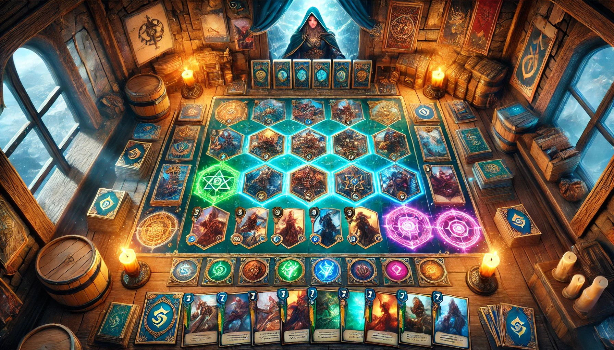

<small>Copyright Brandibur Tudor 322CA 2024-2025 </small>

<h1 style="text-align: center;">GwentStone</h1>

## Overview

This project is a fantasy card game inspired by popular card games like **Gwent** and **Hearthstone**.
The game supports two players competing with customized decks in a
"turn-based" system. Each player aims to reduce their opponent's hero's health to zero, using
strategic card placement and abilities.

---

## Table of Contents

1. [Objective](#objective)
2. [Game Mechanics](#game-mechanics)
3. [Class Structure](#class-structure)

---

## Game Mechanics
This implementation uses JSON files as input. A file contains both players' decks, and multiple rounds
which consist of choosing a deck for each player and a series of commands (the players' actions).
### Basic Rules

- **Two Players**: Simulated by "AI" in this implementation. 
- **Deck Selection**: Players choose a deck at the game's start.
- **Turn-based Gameplay**: Players alternate turns, drawing cards, managing mana, and placing cards on the board.
- **Mana System**: Players receive mana each turn, used to play cards and use cards or heroes abilities.
- **Board Layout**: A 4x5 grid with each player having two rows. Rows 0 and 1 belong to Player 2, rows 2 and 3 to Player 1.
- **Victory Condition**: Reduce the opposing hero's health to zero.

### Gameplay Details

- **Rounds**: Begin by drawing a card and assigning mana.
- **Card Placement**: Cards are placed on the board in sequence from left to right within the player's rows.
- **Hero Abilities**: Each hero has unique abilities influencing the game.

---

## Class Structure and programme flow

### Key Classes
- **Main**: In class `Main` the input is processed form the JSON file and stored in `InputData` variable.
The `game` instance of `Gameplay` is then initialised and the actual game starts.
- **Gameplay**: This class manages the overall flow and state of the programme. It takes the input and extracts the players'
decks. For every round, the specified decks are selected and shuffled, the two players are initialized and then all the actions
are processed using an instance of `ProcessActions` class.
- **ProcessActions**: The 'brains' of the implementation; it contains methods for all the possible different actions, and
it manages an array of `BoardRow` instances which form the actual board. For each action, the output, if
it generates one, is stored in the `output` ArrayNode.
- **Deck**: A collection of cards for each player. The deck is chosen at the start of every round and shuffled.
- **Player**: Represents each player's data, including current deck, hand, mana, hero and the number of won rounds.
It is reinitialized at the start of every round with a new deck and hero, but the number of won games is copied from
the previous instance.
- **Hero**: Designed for **inheritance**, it contains hero-specific attributes and `useHeroAbility()` method which is 
  overridden by each separate hero in order to make the implementation extendable and clear.
- **PlayedCard**: The base class for all cards, extended by specific minion types ( `Disicple` , `Miraj`, `The Cursed One`, `The Ripper`).
Each one has a different, **overridden**, `useCardAbility()` method .
- **BoardRow**: Represents one row of the 4x5 board. It stores an array of `PlayedCard`. (the cards that are currently on that specific row)

### Future reimplementation
The programme can easily be modified to get its input from real players. The JSON files will still
be used to load the players' decks, but the selection of a certain deck and the actions can be
given by players. Also, the `Heroes` and `PlayedCard` classes can be inherited in order to add
new cards and heroes with different and specific abilities.

---
